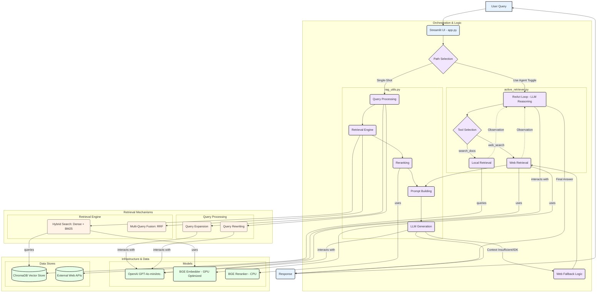

# Landmark Explorer: A Hybrid RAG System with Agentic Web Fallback

[](https://opensource.org/licenses/MIT)

## Introduction

Landmark Explorer is a conversational AI designed to answer complex, fact-based questions about the history, architecture, and significance of 47+ world landmarks, utilizing structured sources like Wikipedia and UNESCO.

Real-world questions are often messy. They may require multi-step reasoning or fresh context beyond a static knowledge base. This system addresses these challenges with a sophisticated hybrid RAG retriever, an agentic web fallback mechanism for complex queries, and a grounded generator that enforces per-sentence citations—ensuring transparency and traceability for every fact.

The application features a Streamlit chat UI with conversational memory and includes a reproducible evaluation harness to rigorously measure performance.

## Key Features

-   **Interactive Chat UI (Streamlit):** Engage in natural conversations; the system intelligently rewrites follow-up questions into self-contained queries.
-   **Advanced Hybrid Retrieval:** Combines dense (vector) and sparse (BM25) retrieval, augmented by Reciprocal Rank Fusion (RRF) and a cross-encoder re-ranking stage for high precision.
-   **Grounded Generation with Citations:** Answers are strictly constrained to the provided context, with every factual statement linked to its source chunk, ensuring high faithfulness (measured at >0.98).
-   **Agentic Web Fallback:** For questions exceeding the local corpus (e.g., "Who designed the Taj Mahal and what other buildings did he design?"), the agent autonomously searches the web to synthesize a complete, cited answer.
-   **Conversational Memory:** Utilizes a short-term buffer and a rolling LLM-generated summary to maintain context without bloating prompts.
-   **Comprehensive Evaluation Harness:** Measures Faithfulness (claim-level entailment), Correctness (LLM-as-a-Judge), Answer Relevance, and Coverage.

## Tech Stack

-   **Frontend:** Streamlit
-   **LLM Provider:** OpenAI (GPT series)
-   **Vector Store:** ChromaDB
-   **Embeddings:** `BAAI/bge-base-en-v1.5` (or similar, run locally)
-   **Web Search (Agentic):** Tavily API / DuckDuckGo
-   **Evaluation:** LLM-as-a-Judge (Supports OpenAI or Gemini to reduce bias)

## Demonstration

The app allows users to chat about landmarks. Each answer provides a "Sources" expander, revealing the exact text chunks used. Users can toggle "Agentic Mode" to observe the system's reasoning and web search processes step-by-step.


* GIF demonstrating the UI and the citation feature.*

## Getting Started

### Prerequisites

-   Python 3.10+
-   An OpenAI API Key.
-   (Optional) Google API Key (for cross-model evaluation).
-   (Optional) Tavily API Key (for agentic web search fallback).
-   (Optional) An NVIDIA GPU for faster embedding generation (CPU is supported).

### Installation

1.  **Clone the repository:**
    ```bash
    git clone [https://github.com/DarshiniMH/landmark-rag.git](https://github.com/DarshiniMH/landmark-rag.git)
    cd landmark-rag
    ```

2.  **Install dependencies:**
    It is recommended to use a virtual environment.
    ```bash
    pip install -r requirements.txt
    ```

### Configuration

Create a file named `.env` in the root of the project and add your API keys and settings:

```env
# --- Required ---
# LLMs
OPENAI_API_KEY=sk-...

# Embeddings (Configuration for local embeddings)
EMBED_MODEL=BAAI/bge-base-en-v1.5
EMBED_DEVICE=cpu              # set to "cuda" on a GPU machine
EMBED_BATCH=64

# --- Optional ---
# Web search (Required for Agentic Fallback)
TAVILY_API_KEY=tvly-...

# Evaluation (Required for running the eval harness)
# Using a different provider (e.g., Gemini) reduces bias vs the GPT generator
GOOGLE_API_KEY=AIza...
EVAL_PROVIDER=gemini          # or openai
EVAL_MODEL=gemini-1.5-pro     # or gpt-4o-mini

# Utility
TOKENIZERS_PARALLELISM=false  # Optional: Silence tokenizer warning
```

### Data Setup

The application requires a local ChromaDB collection. To build the vector database:

```bash
# 1. Process raw data into clean, pruned, and chunked format
python -m scripts.process_chunks

# 2. Embed the chunks and build the ChromaDB collection in vector_db/
python -m scripts.embed_chunks
```

### Running the Application

Launch the Streamlit interface:

```bash
streamlit run app.py
```

Open your browser to `http://localhost:8501` and start chatting.

## Technical Architecture

The system is designed as a multi-stage pipeline optimized for precision, recall, and faithfulness.


*Diagram showing the flow from Query -> Memory/Rewrite -> Retrieval -> Reranking -> Generation OR Agentic Fallback.*

### 1. Data Processing & Ingestion

-   **Cleaning:** Source-specific cleaners remove boilerplate (e.g., Wikipedia templates, HTML navigation).
-   **Pruning:** A BM25-based step increases factual density by removing low-relevance sentences from article sections.
-   **Chunking Optimization:** We used a `RecursiveCharacterTextSplitter`. Extensive experiments were conducted comparing various chunk sizes (350-800) and overlaps (85-150). The optimal configuration was found to be **Size 700, Overlap 110**, which provided the best balance of context precision and recall. (See `experiments/retriever_results.tsv` for full data).

### 2. Retrieval Pipeline

The retrieval process is a sophisticated funnel designed for high precision and recall:

1.  **Query Expansion:** The user's query is first expanded by an LLM to include thematic keywords, improving the semantic richness of the search.
2.  **Hybrid Search:** Parallel searches using dense vectors (semantic meaning) and a BM25 index (lexical matching). After experimentation, a fixed alpha of `0.95` was found to provide the best overall weighting.
3.  **Multi-Query (Optional "Accurate" Mode):** In this mode, the LLM reformulates the user's query twice. It runs a separate search for the original query and each rewrite.
4.  **Fusion (RRF):** If multi-query is used, the results are merged using Reciprocal Rank Fusion (RRF).
5.  **Keyword Filtering:** A post-retrieval filter ensures that all retrieved chunks contain a keyword reference to the target landmark, eliminating "distractor" documents.
6.  **Re-ranking:** A final list of candidates is re-ranked by a more powerful Cross-Encoder to produce the final, high-precision top-k results.

### 3. Generation and Fallback

-   **Grounded Generation:** The generation prompt is highly constrained. The LLM must use only the provided sources, cite every factual statement (e.g., `[Source 1]`), and state "I don't know" if the answer is not in the context. This approach increased the measured **Faithfulness score to >0.98**.
-   **Agentic Web Fallback:** If the local context is insufficient, an agent activates. It uses a search provider (Tavily preferred), fetches the HTML, extracts clean text (using tools like `trafilatura`), chunks the content, and performs a second RAG pass on the new web context.

### 4. Conversation Memory

-   **Buffer:** The last 4 user/assistant turns are held verbatim for immediate context.
-   **Summary:** An LLM-generated rolling summary condenses older history.
-   **Rewrite:** Follow-up questions are rewritten by an LLM into self-contained queries before retrieval to improve accuracy.

## Performance & Evaluation

The system was evaluated using a dedicated harness (`eval/run_eval.py`) that measures key RAG metrics. It supports using a different LLM provider as the "Judge" (LLM-as-a-Judge) to reduce same-model bias. Coverage is reported separately so that "I don't know" responses do not skew the accuracy averages.

Full results are available in `experiments/retriever_results.tsv`.

#### Generator Performance

| Metric          | Score        | Notes                                          |
| --------------- | ------------ | ---------------------------------------------- |
| **Faithfulness** | `~0.98`      | Achieved via the strict citation-forcing prompt. |
| **Correctness** | `~0.95–0.98` | Accuracy of the facts presented.               |
| **Answer Relevance** | `~0.91–0.92` | Semantic similarity to the user query.         |

#### Retriever Performance Highlights

| Configuration                              | Context Precision | Context Recall |
| ------------------------------------------ | ----------------- | -------------- |
| Baseline (Single Query, k=7, pool=40)      | `~0.44`           | `~0.33`        |
| Best Recall (Multi-Query + RRF, pool=80)   | Maintained        | `~0.345`       |
| Highest Precision (Single Query, k=5)      | `~0.522`          | Lower          |


## Project Structure

```
landmark-rag/
│
├── app.py                      # Streamlit chat application entry point
├── manifests/landmarks.yaml    # Landmark data + evaluation questions
├── README.md
├── requirements.txt
│
├── scripts/                    # Data processing and embedding scripts
│
├── utils/
│   ├── rag_utils.py            # Core RAG functions (retrieve, prompt, generate)
│   ├── memory.py               # MemoryManager class
│   └── web_search.py           # Tavily/DDG search tools
│
├── src/agent/
│   └── active_retriever.py     # ReAct agent loop implementation
│
├── eval/
│   ├── metrics.py              # Faithfulness, Correctness, Relevance logic
│   └── run_eval.py             # Main evaluation script
│
├── data/processed/             # (Generated) Cleaned and chunked data (e.g., chunks.jsonl)
└── vector_db/                  # (Generated) ChromaDB collection
```

## Contributing

Contributions, issues, and feature requests are welcome! Feel free to check the issues page.

## License

This project is licensed under the MIT License - see the `LICENSE` file for details.